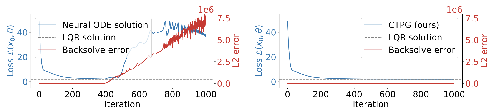

# Continuous-Time Policy Gradients (CTPG)

Here lives the source code for "Faster Policy Learning with Continuous-Time Gradients" by [Samuel Ainsworth](http://samlikes.pizza), [Kendall Lowrey](https://klowrey.github.io/), [John Thickstun](https://homes.cs.washington.edu/~thickstn/), [Zaid Harchaoui](http://faculty.washington.edu/zaid/) and [Siddhartha Srinivasa](https://goodrobot.ai) presented at Learning for Dynamics and Control (L4DC) 2021.

Have you ever wondered what would happen if you took deep reinforcement learning and stripped away as much stochasticity as possible from the policy gradient estimators? Well, wonder no more!

## Usage

Much of the code was written against Julia version 1.5.1. The MuJoCo related experiments will also require access to a MuJoCo installation. DiffTaichi experiments require access to the DiffTaichi 0.7.12 differentiable simulator. This should be installed automatically by running `] build` in this Julia project.
